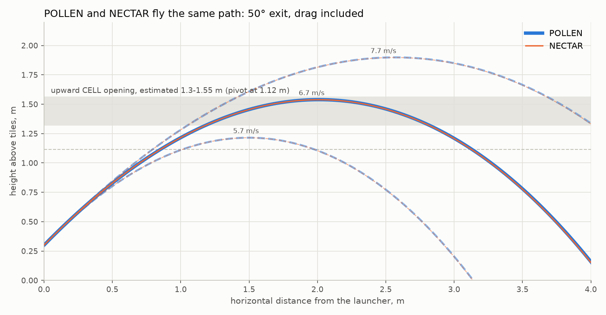
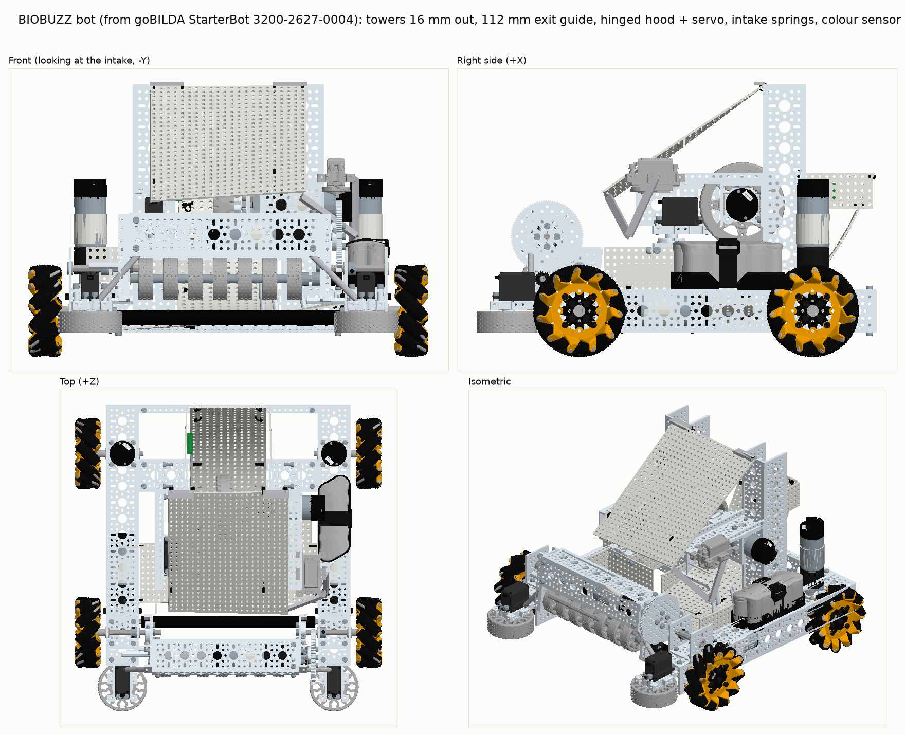
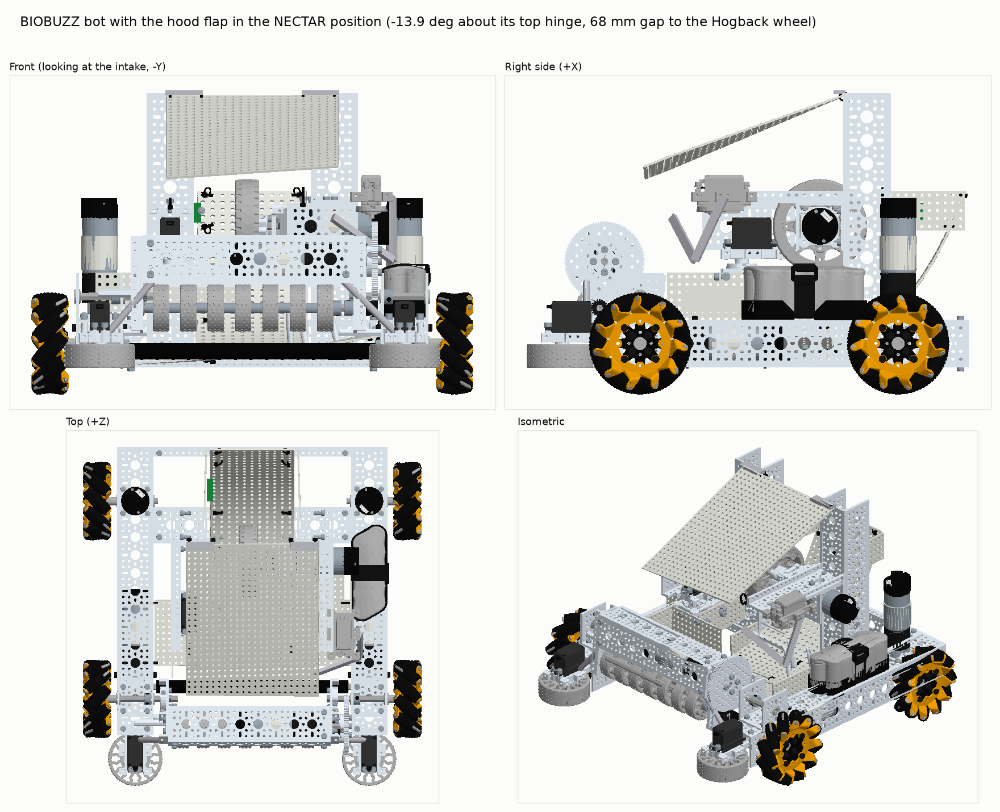
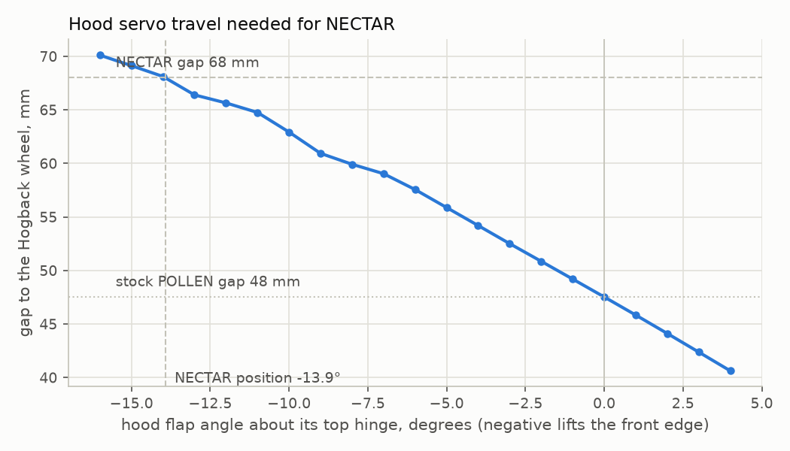
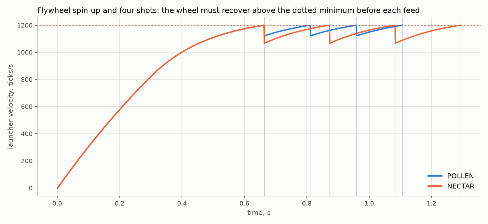
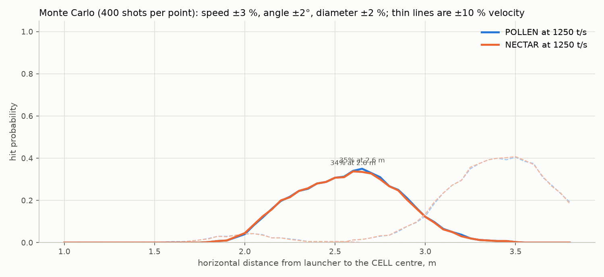

# BIOBUZZ bot: StarterBot 3200-2627-0004 with POLLEN and NECTAR intake and launching

This folder is a new build derived from the goBILDA FTC StarterBot with Mecanum Wheels
(3200-2627-0004, torn down in [`../gobilda-3200-2627-0004/`](../gobilda-3200-2627-0004/README.md)).
The basis is left untouched. The stock StarterBot intakes and launches POLLEN only; the changes
here make the same robot intake and launch NECTAR too, and add the software that tells the two
apart. Robot code lives in
[`TeamCode/.../teamcode/biobuzz/`](../../TeamCode/src/main/java/org/firstinspires/ftc/teamcode/biobuzz/).

## 1. What the game asks of the robot

Source: BIOBUZZ Competition Manual V1, sections 9 to 12 (fetched 2026-09-21).

| item | value | consequence for the design |
|---|---|---|
| POLLEN | 2.8 in (71 mm) yellow ball, 24.9 g, 40 per match | stock StarterBot size |
| NECTAR | 3.6 in (92 mm) red or blue ball, 41.3 g, 8 per alliance | 21 mm larger, 66 % heavier, colour matters |
| element size varies (9.8) | "not perfectly spherical and may vary" | leave clearance, use compliant wheels |
| G407 | never CONTROL more than 4 elements | intake stops at four, guards on top |
| G408 | never CONTROL opponent NECTAR | sense colour at the chute and spit the wrong colour out |
| G417 | HIVE tips only by LAUNCHING into the upward CELL | launcher must reach the cell for both balls |
| G410 | NECTAR into FLOWERS only in the last 60 s | driver rule, no hardware impact |
| HIVE (9.6) | pivot axis 43.95 in (1.12 m) above the tiles, CELL opening 20 x 14 x 12 in | target roughly 1.3 to 1.55 m high, verify on a field |
| FLOWER (9.7) | top opening 4 in (102 mm) at 21.5 in (546 mm), NECTAR fits | out of scope here; the launcher is the scoring path |
| R102 | starting configuration 18 x 18 x 18 in | StarterBot is 452 x 452 x 308 mm, so nothing may grow |
| R105 | expansion 18 x 24 x 29 in | hood and floating intake stay inside |
| 10.3.1 | 4 POLLEN pre-loaded per robot | auto launches four |

## 2. What the StarterBot already does, measured from the STEP file

Numbers are millimetres above the tiles, taken from the wireframe in the teardown.

| feature | measurement |
|---|---|
| front intake roller bar (16 x 16 mm rollers on the 264 mm REX shaft) | axis 44 mm high, 264 mm wide |
| Gecko-wheel conveyor (7 x 48 mm on the 240 mm REX shaft) | axis 88 mm high, wheel bottom 64 mm, driven at 585 rpm (117 rpm motor through 100T:20T) |
| intake ramp, Gridplate E | 30 to 65 mm high |
| chute between the two vertical 10-hole tower channels | 88 mm inside width, side walls are Gridplates C |
| curved chute ramp, Gridplate G | 88 mm wide, 11 x 35 holes |
| windmill feeder (torque servo, four 40 x 96 mm paddles A) | in the chute below the wheel |
| launcher wheel, 96 mm Hogback on a 1:1 Yellow Jacket | axis 172 mm high, 24 mm wide |
| hood, Gridplate H (176 x 216 mm) above and in front of the wheel | tightest gap to the wheel 47 mm |
| top of the robot | 307 mm |

The 47 mm gap compresses a 71 mm POLLEN by 24 mm. A 92 mm NECTAR would need 45 mm of
compression and will jam, and a 92 mm ball cannot enter an 88 mm chute at all. Those two
numbers drive changes B and C below. The intake conveyor grabs POLLEN with 7 mm of squeeze
against the ramp; NECTAR would need 28 mm, which drives change A.

## 3. The changes

### A. Floating intake conveyor (NECTAR and POLLEN with one roller)

Keep the 48 mm Gecko conveyor but let its 8-hole U-channel carrier (assembly steps 19 to 25)
pivot on the two 80 mm REX shafts in the 1-hole U-channels (step 29), instead of being bolted
solid in step 31. Hard stop at the stock height, so POLLEN is squeezed 5 to 6 mm as today
(measured in section 9). Two extension springs (2915-0001-0003, 1.5 kg) from the carrier to the
15-hole base channel pull it down; a NECTAR would need 27 mm of squeeze at the stock height, so it
lifts the carrier about 21 mm against the springs and is gripped with the same 6 mm. Set the spring
hooks so the springs are near their 39 mm free length at the hard stop. Check the raised
position stays under 18 in during inspection (it adds nothing above the 307 mm top).

Fallback if the pivot is not wanted: raise the conveyor 8 mm (one hole) and rely on the 30A
Gecko wheels; POLLEN then only gets 0 to 2 mm of squeeze and intake reliability drops.

### B. Wider launcher bay and exit guide (120 mm between the towers)

The Hogback wheel, the windmill and the exit guide all sit between the two vertical 10-hole
tower channels, whose inner faces are 88 mm apart. Both towers move two holes (16 mm) outboard
on the 15-hole base rails, which keeps every bolt on the 8 mm pattern and needs no new channel:

1. Unbolt the tower feet (quad blocks, step 35 and 36) and re-fit them 16 mm outboard. The
   forward arms, the 2-hole channel, the windmill servo and its ServoBlock ride with their
   tower; the launcher motor's quad block is re-mounted two holes inboard on the moved 2-hole
   channel so the Hogback wheel stays on the robot centre line.
2. Cut a new exit guide G' 14 x 35 holes (112 x 280 mm) from one extra large gridplate
   (1117-0216-0352) and zip-tie it in with the step 43 to 49 pattern; the side walls C stay on
   the tower inner faces, now 120 mm apart, which leaves 14 mm each side of a 92 mm NECTAR and
   4 mm each side of the guide.
3. The hood plate H (176 mm wide) still spans the bay and zip-ties to the same channels.

### C. Servo-adjustable hood

Gridplate H is the flat, back-leaning plate over the launcher: its top edge sits at the tower
tops (307 mm up, at the towers) and its lower edge is at the front over the intake (175 mm up).
It becomes a flap: hinge the top edge to the tower tops with two 5-hole hinges (2902-0005-0038)
and lift the lower front edge with a torque servo (2000-0025-0002 in positional mode, in a
Compact ServoBlock on the outer face of the right forward arm, near its front end) through a
9-hole flat beam crank and a second 9-hole flat beam as pushrod (1102-0009-0072, M4 x 12
screws with nylock nuts as pivots).

| position | wheel-to-hood gap | squeeze | flap angle (from `clearance_sim.py`) | servo position (start value) |
|---|---|---|---|---|
| POLLEN | 47.5 mm (stock) | 24 mm | 0° | `HOOD_POLLEN = 0.30` |
| NECTAR | 68 mm | 24 mm | 13.9° open | `HOOD_NECTAR = 0.55` |

The lower edge is 216 mm from the hinge, so the NECTAR position lifts it about 52 mm; a 72 mm
crank arm covers that with margin. Tune both positions with the dpad in TeleOp until each ball
leaves cleanly; the same squeeze for both balls keeps the exit speed ratio the same, which is why
one velocity target serves both.

### D. Element sensor

A REV Color Sensor V3 in a hole of side wall C, about 30 mm before the windmill, sees every
ball once. Its distance reading gives presence, its hue gives POLLEN (yellow), red NECTAR or
blue NECTAR. Software then:

- counts elements in and out (G407 guard, intake stops at four),
- reverses the intake for 0.7 s when the wrong alliance colour is seen (G408),
- keeps a first-in-first-out queue so the hood and wheel speed are set for the ball that is
  about to be fed.

## 4. Launch physics: one speed setting for both balls

`tools/trajectory.py` integrates both balls with quadratic drag. The ballistic coefficient
(half rho Cd A / m) is 0.0450 /m for POLLEN and 0.0453 /m for NECTAR: NECTAR has 68 % more
frontal area and 66 % more mass, so the two fly the same path at the same exit speed.



At goBILDA's stock 1250 ticks/s (2679 rpm, 13.5 m/s surface speed, about 6.7 m/s ball speed)
a 50 degree exit peaks at 1.55 m about 2 m out, inside the estimated CELL band. What changes
for NECTAR is the energy taken from the wheel per shot:

| ball | kinetic energy per shot | momentum |
|---|---|---|
| POLLEN | 0.56 J | 0.168 kg m/s |
| NECTAR | 0.94 J | 0.278 kg m/s |

so the wheel droops more after each NECTAR. Both balls use the same 1250 ticks/s target: the
shot simulation (section 9.2) showed that a 4 % higher NECTAR target moves its landing point
0.4 m further out, so the two would need different aim points. Instead the code does not feed
until the wheel is back above the minimum, goBILDA's "wait for speed" logic applied per
element. The exit angle and the CELL band are estimates: measure the hood angle on the built
robot and check the shot on a real HIVE.

## 5. Control system

Hardware configuration (names match goBILDA's mecanum StarterBot sample, plus two new devices):

| name | device | port suggestion |
|---|---|---|
| `Front_Left`, `Rear_Left` | 19.2:1 Yellow Jacket, REVERSE | Control Hub motors 0, 1 |
| `Front_Right`, `Rear_Right` | 19.2:1 Yellow Jacket, FORWARD | Control Hub motors 2, 3 |
| `launcher` | 1:1 converted Yellow Jacket, encoder required | Expansion Hub motor 0 |
| `intake` | 50.9:1 Yellow Jacket conveyor | Expansion Hub motor 1 |
| `left_intake_servo`, `right_intake_servo` | 2000-0025-0003 in continuous mode | servo 0, 1 |
| `windmill` | 2000-0025-0002 in continuous mode, REVERSE | servo 2 |
| `hood` (new) | 2000-0025-0002 in positional mode | servo 3 |
| `element_sensor` (new) | REV Color Sensor V3 | I2C bus 1 |

Op modes:

- **BioBuzz TeleOp**: left stick drive/strafe, right stick rotate, left bumper slow mode,
  right/left trigger intake in/out, right bumper spin up and feed, A launcher off, dpad up/down
  hood trim, Y clear the element estimate, Back set the estimate to four. X/B before start
  choose blue/red.
- **BioBuzz Auto**: launches the four pre-loaded POLLEN, then drives off the wall for LEAVE.
  Time based; the two constants at the top of the file are the only tuning.

Every number lives in `BioBuzzConfig.java`. Tuning order on the robot:

1. Hood: with the launcher off, feed a POLLEN by hand and adjust `HOOD_POLLEN` until the ball
   is squeezed but the windmill can push it through; repeat with NECTAR for `HOOD_NECTAR`.
2. Sensor: read the `Sensor` telemetry line with each ball in the chute and adjust the hue
   bands and `SENSOR_PRESENT_MM` if needed.
3. Velocity: shoot at the HIVE from the launch spot and adjust the two `LAUNCH_VELOCITY_*`
   targets; keep the minimums about 50 ticks/s below the targets.
4. Feed timing: if the element count drifts, adjust `FEED_SECONDS_PER_ELEMENT`.

## 6. Bill of materials

- `bom_delta.csv`: the 12 lines to buy on top of the starter kit.
- `bom_biobuzz_bot.csv`: the full purchase list, starter kit plus delta, generated by
  `tools/make_bom.py`.

| sku | qty | purpose |
|---|---|---|
| 1117-0216-0352 | 1 | wider chute ramp and hopper floor |
| 2000-0025-0002 | 1 | hood servo |
| 3217-0001-2501 | 1 | hood servo mount |
| 1102-0009-0072 | 1 pack | hood crank and pushrod |
| 2902-0005-0038 | 2 | hood hinges |
| 2915-0001-0003 | 2 | floating intake springs |
| 2800-0004-0012, 2812-0004-0007, 2909-0101-0100 | 1 pack each | pivots and zip ties |
| REV-31-1557 (+ JST PH cable) | 1 | element sensor |

## 7. Open items

- The exit angle of the hood and the exact height of the upward CELL opening are estimates.
- The floating intake pivot is described and drawn as springs, not modelled as a mechanism;
  check its raised position against the 18 in cube.
- Feed counting is time based. A second sensor at the launcher exit would make it exact.
- FLOWER scoring (placing into a 102 mm opening at 546 mm) is not addressed by this build.
- The flywheel inertia in the shot simulation is an estimate (no mass data in the STEP).

## 8. STEP model and render

`tools/build_biobuzz_step.py` opens goBILDA's STEP with OpenCascade XDE (the assembly tree,
part names and colours survive) and edits it in place: it moves the towers and everything bolted
to them, re-cuts the exit guide 112 mm wide, hinges the hood, and adds the hinges, the hood servo
and ServoBlock (copies of the kit's own parts), the crank and pushrod beams, the two intake
springs and the colour sensor as simplified solids. The result, `biobuzz-bot.step`, is a 496 MB
AP214 file (82 MiB zipped) with 1,263 leaf parts; it is too large for this repository and was
delivered separately, and rebuilds in about five minutes:

```bash
pip install cadquery                                   # brings the OCP OpenCascade bindings
python3 tools/build_biobuzz_step.py 3200-2627-0004.step biobuzz-bot.step
python3 tools/build_biobuzz_step.py 3200-2627-0004.step hood-open.step --hood-angle -13.9
python3 tools/render_step.py biobuzz-bot.step render_biobuzz_bot.png
```

`tools/render_step.py` meshes every leaf part (8.7 M triangles) and draws four shaded views in
the STEP colours:



The same model with the hood flap in the NECTAR position:



## 9. Simulations

### 9.1 Ball-path clearance (`tools/clearance_sim.py`, exact geometry from the edited model)

The parts around the ball path are meshed at 0.4 mm and every clearance below is a
point-to-triangle distance on those meshes. The hood flap is swept about its hinge and the
gap to the Hogback wheel measured (chart), then POLLEN, NECTAR and an oversize NECTAR are
placed at stations along the path.



| station | POLLEN 71 | NECTAR 92 | NECTAR 95 | reading |
|---|---|---|---|---|
| on the tiles against the roller bar, conveyor squeeze | -4.7 | -27.2 | -30.1 | change A: the carrier floats 21 to 24 mm |
| under the conveyor axis, conveyor squeeze | -6.4 | -27.0 | -30.0 | same |
| on the intake ramp E (windmill paddles excluded) | +25.2 | +21.4 | +20.9 | clear |
| hopper floor in front of the wheel (paddles excluded) | +7.2 | +5.7 | +5.5 | clear, tightest point is the guide's lower end |
| exit guide between the side walls | +17.4 | +9.1 | +7.9 | clear; nearest part is the wheel |
| launcher squeeze, hood at 0° (47.5 mm gap) | 23.6 | 44.4 | 47.5 | POLLEN setting; NECTAR would jam |
| launcher squeeze, hood at 13.9° open (68 mm gap) | 3.1 | 23.9 | 27.0 | NECTAR setting |

Negative numbers are interference a compliant part must absorb; the two conveyor rows are the
whole case for the floating intake. Full numbers are in `clearance_sim.json`.

### 9.2 Launcher dynamics and shot dispersion (`tools/shot_sim.py`)

A linear DC-motor model of the bare 6000 rpm Yellow Jacket driving the Hogback wheel through
the SDK velocity PIDF (P = 40, F = 12.5), with an estimated wheel inertia of 1.7e-4 kg m², and a
per-shot energy draw of 1.5 times the ball's kinetic energy:



| | POLLEN | NECTAR |
|---|---|---|
| spin-up to the 1200 ticks/s minimum | 0.66 s | 0.66 s |
| velocity droop per shot | 78 ticks/s | 133 ticks/s |
| gap between shots once recovered | 0.15 s | 0.21 s |

Four NECTAR leave in under a second; the code's wait-for-minimum gate is what keeps the exit
speed consistent. A Monte Carlo of 400 shots per distance (exit speed ±3 %, exit angle ±2°,
ball diameter ±2 %) counts a hit when the descending ball crosses the CELL opening plane inside
its 12 in depth:



At the shared 1250 ticks/s both balls peak at 35 % from 2.6 m; the dashed ±10 % velocity curves
move the sweet spot by about 0.5 m either way. The peak is limited by the ±3 % speed jitter,
which is why the velocity gate matters more than the hood for accuracy. The CELL height and
exit angle are the same estimates as in section 4.
