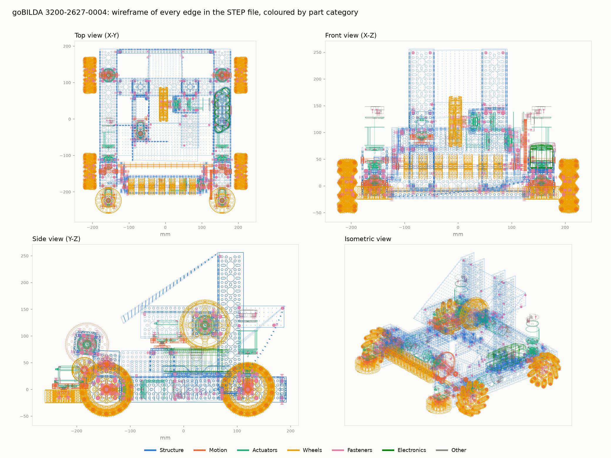
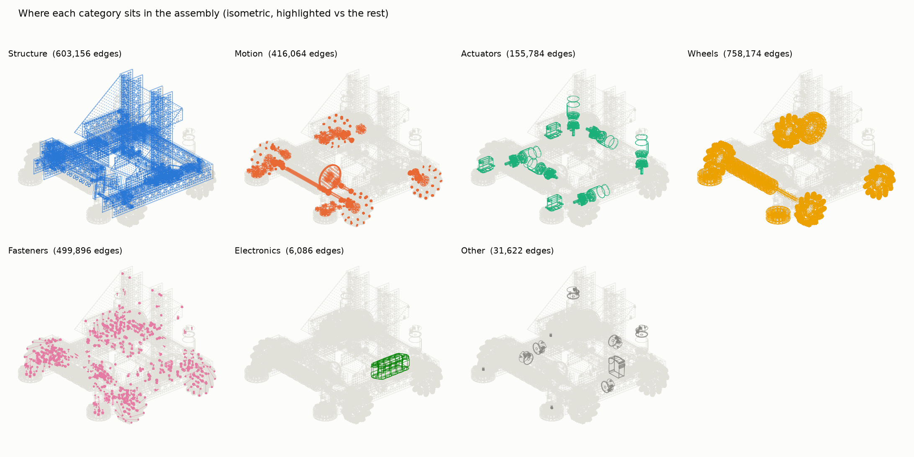
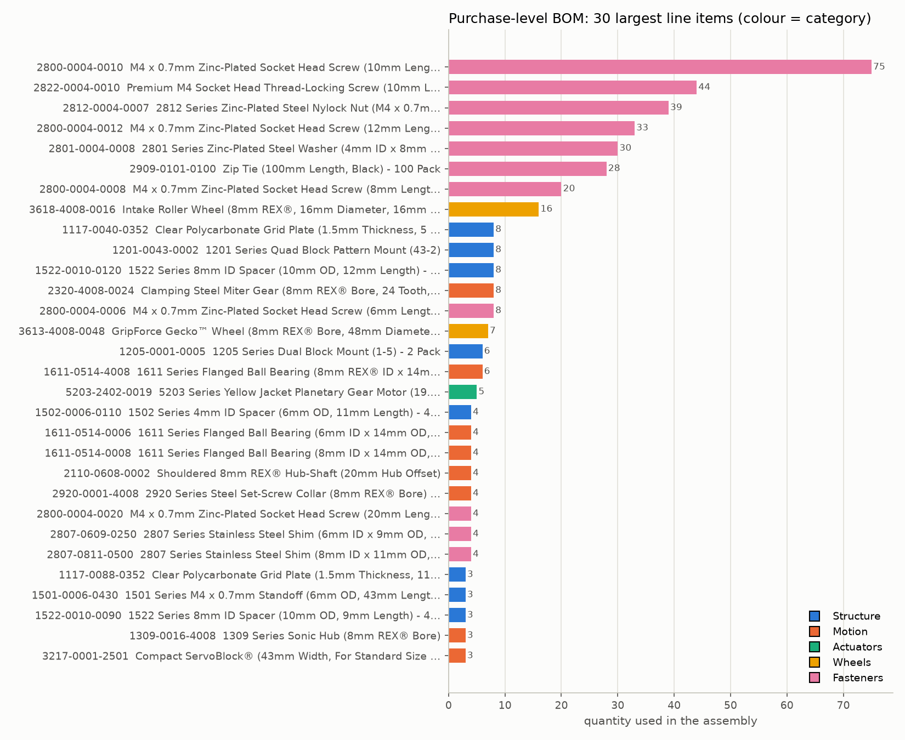
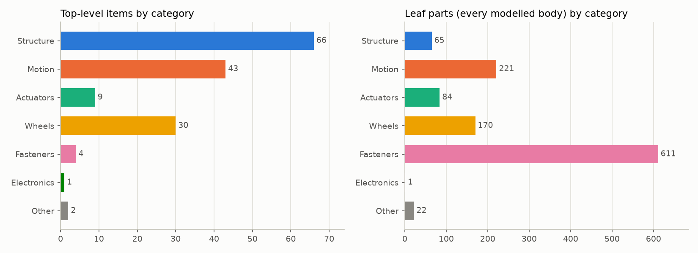
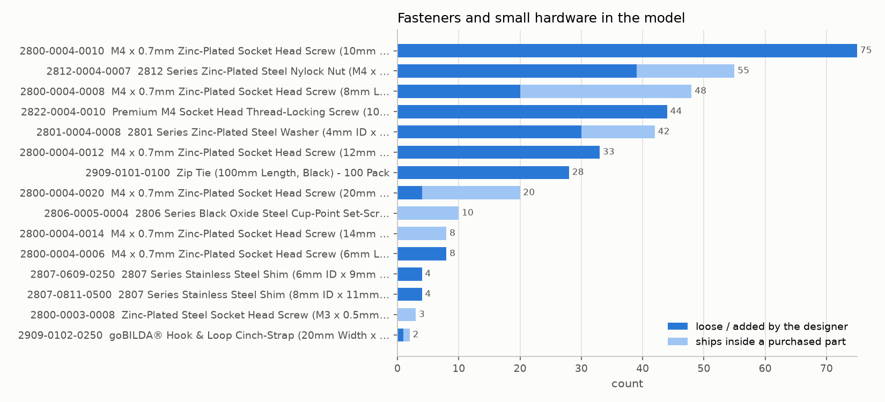

# goBILDA 3200-2627-0004: STEP teardown, BOM and visualisation

Source: <https://www.gobilda.com/content/step_files/3200-2627-0004.zip> (70 MB zip, 420 MB STEP AP214,
exported from Autodesk Fusion on 2026-09-09). The STEP file itself is not committed; everything here is
derived from it with the two scripts in `tools/`.

## What the model is

A complete FTC-style robot on a mecanum drive base. Overall envelope of the modelled geometry:

| axis | size |
|---|---|
| X (width) | 452 mm |
| Y (length) | 452 mm |
| Z (height) | 308 mm |

Main mechanisms visible in the wireframe:

- **Drive base** of 1120/1121 U-channel with four 104 mm GripForce mecanum wheels, each on a Yellow Jacket
  312 RPM motor (5203-2402-0019) through a Sonic/Hyper hub or shouldered hub-shaft.
- **Roller intake** at the front: sixteen 16 mm intake roller wheels stretched over a 264 mm REX shaft,
  driven through clamping miter gears (eight 2320-4008-0024).
- **Launcher / transfer**: a 100-tooth MOD 0.8 gear and 20-tooth pinion, seven 48 mm and two 72 mm
  GripForce Gecko wheels, one 96 mm Hogback traction wheel, driven by a fifth 312 RPM motor and a
  117 RPM motor (5203-2402-0051).
- **Three 2000-series servos** in Compact ServoBlocks, a 12 V NiMH nested battery in its mount,
  clear polycarbonate grid plates as guards and shelves.





## Numbers

| metric | value |
|---|---|
| STEP entities | 4,314,214 |
| distinct PRODUCT definitions | 377 (Fusion duplicates components as `_1`, `_2`, …) |
| assembly occurrences (NEXT_ASSEMBLY_USAGE_OCCURRENCE) | 1,392 |
| nodes in the expanded tree | 1,475, max depth 5 |
| leaf bodies (every screw, bearing race, roller pin) | 1,174 |
| direct children of the root | 155 items in 91 lines |
| purchase-level BOM | 58 goBILDA SKUs, 436 units |
| fasteners and small hardware anywhere in the model | 384 |
| wireframe edges rendered | 2,470,782 |

Purchase-level BOM, 30 largest lines:







## Files

| file | contents |
|---|---|
| `BOM.md` | all four tables below in one Markdown document |
| `bom_purchase.csv` | one row per goBILDA SKU with quantity, pack size, packs to buy, and where the name came from |
| `bom_top_level.csv` | the 91 direct children of the root exactly as modelled (part vs subassembly) |
| `bom_flat_leaf_parts.csv` | every leaf body, including motor and wheel internals |
| `fasteners.csv` | fastener totals split into loose vs shipping inside a purchased part |
| `subassemblies.csv` | contents of every subassembly, one row per distinct label |
| `assembly_tree.txt` | full indented occurrence tree with product names |
| `stats.json` | the numbers above plus the bounding box |
| `tools/parse_step.py` | streaming STEP parser: product graph, quantity roll-up, wireframe with assembly transforms |
| `tools/make_report.py` | tables, charts and renders from the parser output |
| `tools/sku_catalog.tsv` | SKU to name/URL map; `source` column says `gobilda.com`, `inferred` or `unknown` |

## How the BOM was built

1. `parse_step.py` streams the file once, keeps only the assembly and topology entities, and follows
   `PRODUCT_DEFINITION` → `NEXT_ASSEMBLY_USAGE_OCCURRENCE` links from the single root down. Every
   occurrence gets its 4×4 placement by composing `ITEM_DEFINED_TRANSFORMATION` axes along the path.
2. Each part's `MANIFOLD_SOLID_BREP` is walked to its edge curves; lines become one segment, circles are
   sampled as arcs, other curves are drawn as chords. That wireframe is transformed into robot
   coordinates, which is what the renders show (no CAD kernel needed).
3. Quantities come from counting paths in the tree. The purchase-level BOM counts each SKU-bearing node
   directly under the root, expands folders without a SKU (loose `Hardware`, `Zip Ties`) and groups the
   designer labelled `w.Hardware`, and treats the Compact ServoBlock as a kit whose bearing, hub shaft and
   screws ship in the box. The two mecanum wheel halves are folded into the four-wheel set SKU.
4. Names were fetched from gobilda.com product-search cards by exact SKU. Ten SKUs had no exact page
   (screw lengths 10/12/14 mm, the 8 mm-OD washer, the M4 nylock nut, the 12 mm servo hub shaft,
   individual mecanum wheels, E-clips, roller bearings) and are named by series convention and marked
   `inferred`; `1805-0043-0001` (a ServoBlock component) has no match.

## Caveats

- `packs_to_buy` uses the pack size in the product name; `inferred` names have no pack size, so those
  rows show one pack per unit.
- The category colour comes from keyword rules over the product name and is only for orientation.
- Motor, servo and wheel internals (gearbox plates, roller pins, encoder caps) appear in the flat leaf
  BOM but are intentionally absent from the purchase BOM.

To regenerate:

```bash
unzip 3200-2627-0004.zip
python3 tools/parse_step.py 3200-2627-0004.step /tmp/step_out     # ~30 s, ~6 GB RAM
python3 tools/make_report.py /tmp/step_out .                        # ~5 min for the renders
```
